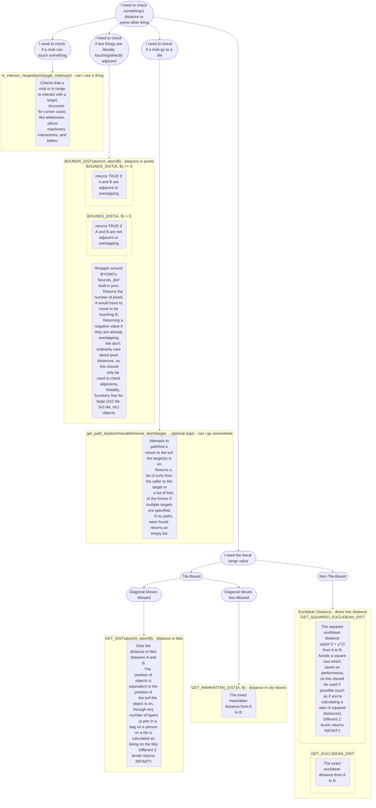

# Goonstation Code Guide

[ToC]



# General

## Operators
* Don't use `goto`. Bad.
* Don't use the `:` operator to override type safety checks. Instead, cast the variable to the proper type.
* Don't use `del`, it's horrendously slow. Use `qdel()`.
* Don't use `<>`, it's completely unused in the land of SS13. Use `!=` instead, as it's infinitely more sane.

## Stuff To Use

* Use `SPAWN()` instead of `spawn()`
* Use `TIME` instead of `world.timeofday`
* Bitflags (`&`) - Write as `bitfield & bitflag`
* Use `'foo.ogg'` instead of `"foo.ogg"` for resources unless you need to build a string (e.g. `"foo_[rand(2)].ogg"`).
* Use `FALSE` and `TRUE` instead of `0` and `1` for booleans.

# Syntax

## Commenting

### Purpose
When possible, we always want people to document their code clearly so that others (or perhaps yourself in the future) can understand and learn why a piece of code was written. 

Unless the code is extremely complex, what one generally wants to comment is the *motivation* behind a certain piece of code, or what it's supposed to fix - rather than what it's actually doing.

### Doc Comments
Additionally, we have a 'documentation comment' system set up. This is as simple as commenting code like:
```cs
/obj/item/clothing/suit
    /// If TRUE the suit will hide whoever is wearing it's hair
    var/over_hair = FALSE
```
By using this, when you hover over a variable or object, it'll display information in the comment. For example:


For more detailed information on this system, see the [DMByExample page](https://spacestation13.github.io/DMByExample/meta/dmdoc.html).


## Defines to use

### Time Defines

The codebase contains some defines (e.g. `SECONDS`) which will automatically multiply a number by the correct amount to get a number in deciseconds. Using these is preferred over using a literal amount in deciseconds.

### SI Units

The codebase also has defines for other SI units, such as `WATTS`. There are also SI unit prefixes for use, such as `MILLI`. These should be used whenever you're dealing with a quantity that's a SI unit. If you're using a derived unit, add its formula to the defines. These can be chained like so: `100 MILLI WATTS` or `1 KILO METER`.

## No magic numbers

Don't use numbers that have no explanation behind them. Instead, it's reccomended that you either put it into a const variable, a local file #define, or a global #define.

<span style="color: red">Bad:</span>
```csharp
proc/do_stuff(thing)
	switch(thing)
		if(0)
			stuff
		if(1)
			other stuff
```

<span style="color: green">Good:</span>
```csharp
#define DO_THING_CORRECT 0
#define DO_THING_OTHER 1
proc/do_stuff(thing)
	switch(thing)
		if(DO_THING_CORRECT)
		    stuff
		if(DO_THING_OTHER)
			other stuff
```

If you don't need the define anywhere outside this file/proc, make sure you undefine it after:

```csharp
#undef DO_THING_CORRECT
#undef DO_THING_OTHER
```
## Use early returns

We don't want dozens of nesting levels, don't enclose a proc inside an if block if you can just return on a condition instead.

<span style="color: red">Bad:</span>
```csharp
obj/test/proc/coolstuff()
    if (foo)
        if (!bar)
            if (baz == 420)
                do_stuff
```
<span style="color: green">Good:</span>
```csharp
obj/test/proc/coolstuff()
    if (!foo || bar)
        return
    if (baz == "error_code")
        return
    do_stuff
```

## `foo.len` vs. `length(foo)`

Our codebase uses the latter, the `length(foo)` syntax.

The `.len` syntax runtimes on a null `foo`, whereas the `length()` syntax will not.
It's also faster (~6%), for internal bytecode reasons (which don't really matter).

## Abstract types and typesof

Some types exist just as a parent and should never be created in-game (e.g. `/obj/item`). Mark those using the `ABSTRACT_TYPE(type)` macro. You can check if a type is abstract using the `IS_ABSTRACT(type)` macro.

To get a list of all concrete (non-abstract) subtypes of a type you should use `concrete_typesof(type)`, the result is cached so no need to store it yourself. (As a consequence please `.Copy` the list if you want to make changes to it locally.) Proper usage of `ABSTRACT_TYPE` + `concrete_typesof` is preferred to using `typesof` and `childrentypesof` *usually* though exceptions apply.

If you want to filter the results of `concrete_typesof` further (e.g. by the value of a var or by a blacklist) consider using `filtered_concrete_typesof(type, filter)`. `filter` is a proc that should return 1 if you want to include the item. Again, the result is cached (so the `filter` proc should not depend on outisde variables or randomness).

Example:
```javascript
ABSTRACT_TYPE(/obj/item/hat)
/obj/item/hat
	var/is_cool = FALSE

/obj/item/hat/uncool
	name = "Uncool Hat"

/obj/item/hat/cool
	name = "Cool hat"
	is_cool = TRUE

proc/is_hat_cool(hat_type)
	var/obj/item/hat/hat = hat_type
	return initial(hat.is_cool)

proc/random_cool_hat()
	return pick(filtered_concrete_typesof(/obj/item/hat, /proc/is_hat_cool))
```

See `_stdlib/_types.dm` for details.

## Whitespace

### Spaces after control statements

See: `if(x)` vs `if (x)`

Nobody cares about this. This is heavily frowned upon for changing with little to no reason.

### Spacing in lists, proc definitions/calls, and arithmetic
Always put spaces after commas or operators, and before operators:

<span style="color: red">Bad:</span>
```csharp
var/whatever=list(1,2,3)
var/whatever2=multiply_some_numbers(2,2,2)
var/whatever3=3+4-whatever2
```

<span style="color: green">Good:</span>
```csharp
var/whatever = list(1, 2, 3)
var/whatever2 = multiply_some_numbers(2, 2, 2)
var/whatever3 = 3 + 4 - whatever2
```

## Very long lines
For long lines, use `\` at the end of the line to split onto multiple lines.
With the recommended extension pack, a vertical line will appear in the editor; if your code goes far beyond this line, it's time to split the code into multiple lines. Put a space before `\`.

When doing this, indent each line past the first to 1 tab past the start of the right side of the definition (or whatever is similar- for proc calls, 1 tab past the proc name, etc).

<span style="color: red">Bad:</span>
```csharp
var/moby_dick = "Call me Ishmael. Some years ago—never mind how long precisely—having little or no money in my purse, and nothing particular to interest me on shore, I thought I would sail about a little and see the watery part of the world. It is a way I have of driving off the spleen and regulating the circulation. ""
```

<span style="color: green">Good:</span>
```javascript
var/moby_dick = "Call me Ishmael. Some years ago—never mind how long precisely \
                    —having little or no money in my purse, and nothing \
                    particular to interest me on shore, I thought I would sail \
                    about a little and see the watery part of the world. It is \
                    a way I have of driving off the spleen and regulating \
                    the circulation."
```

Lists follow a similar pattern, but `\` isn't required.

<span style="color: red">Bad:</span>
```csharp
var/list/list_of_integers = list(1, 2, 3, 4, 5, 6, 7, 8, 9, 10, 11, 12, 13, 14, 15, 16, 17, 18, 19, 20, 21, 22, 23, 24, 25, 26, 27, 28, 29, 30, 31, 32, 33, 34, 35, 36, 37, 38, 39, 40, 41, 42, 43, 44, 45, 46, 47, 48, 49, 50)
```

<span style="color: green">Good:</span>
```csharp
var/list/list_of_integers = list(1, 2, 3, 4, 5, 6, 7, 8, 9, 10, 11, 12, 13, 14, 
                                15, 16, 17, 18, 19, 20, 21, 22, 23, 24, 25, 26, 
                                27, 28, 29, 30, 31, 32, 33, 34, 35, 36, 37, 38, 
                                39, 40, 41, 42, 43, 44, 45, 46, 47, 48, 49, 50)
```

For lists of long expressions, 1 line per expression is fine.

<span style="color: green">Good:</span>
```csharp
var/list/dog_types = list(/mob/animal/dog/labrador, 
                         /mob/animal/dog/chihuahua,
                         /mob/animal/dog/daschund,
                         /mob/animal/dog/retriever,
                         /mob/animal/dog/pug)
```

## Always use explicit `src`
In procs which are called on an object (i.e. everything but global procs), `src` is the object which the proc is being called on. To reference a variable on this object, you should always use `src.varname`. Simply referencing `varname` (leaving the `src` implicit) should be avoided, as it is less clear and leads to bugs while refactoring.

The same goes for procs- to call a proc on the same object, use `src.procname()`.

<span style="color: red">Bad:</span>
```javascript
/datum/thing
    var/num = 10
    
/datum/thing/proc/add_one(var/add_another_time)
    num += 1
    if (add_another_time)
        add_one(FALSE)
```

<span style="color: green">Good:</span>
```javascript
/datum/thing
    var/num = 10
    
/datum/thing/proc/add_one(var/add_another_time)
    src.num += 1
    if (add_another_time)
        src.add_one(FALSE)
```

## Variable and argument names
Very short (1-2 character) variable/argument names are acceptable *only* if they are the standard names for common types.
* `/atom` - `A`
* `/atom/movable` - `AM`
* `/obj` - `O`
* `/obj/item` - `I`
* `/obj/item/grab` - `G`
* `/mob` - `M`
* `/mob/living` - `L`
* `/mob/living/critter` and `/obj/critter` - `C`
* `/mob/living/carbon/human` - `H`
* `/turf` - `T`

Names should be descriptive unless the context and type make it immediately clear what the variable is used for. This includes the above names- only use them if it is clear what the variable is for.

<span style="color: red">Bad:</span>
```csharp
var/obj/item/M
var/turf/J

proc/feed_person_food(mob/person_one, mob/person_two, obj/item/food/F)
```

<span style="color: green">Good:</span>
```csharp
var/obj/item/I
var/turf/T

proc/feed_person_food(mob/person_feeding, mob/person_eating, obj/item/food/fed_food)
proc/move_ghost_to_turf(mob/dead/ghost/target, turf/T)
```

## Flowchart: Check distances between things


## Flowchart: Get things in an area around a thing
![](https://mermaid.ink/img/pako:eNqlVm2L20YQ_iuDvtgGNUfJt6NcKdw1OWhaOB8JoS7HSjuyt5F23d2VXRPy3zMzK1mS7RxHog-2NDuvz7zsfM5KpzG7zqra7cuN8hEeb1cW6PHOxfnfq-weLKKG6GCNERTUJkRwFeAO_SFujF2DsRBcg6A8qhxUWTqvmU4yQt9g60nKlKvsn0XSnn53Jhhnk5WSpEEVro0deWAulS0wIArnO7dTRY0B4kZFPoICgQ-h8q7pHImu-aXwN_Pl8ufX5PF6E9kfrfwniyGACWBdFE9bGym6yvnFxB4pZGN3HCQ0rhis0clgJMkkqQ0qfxYKE8n0mM-rvSY0Equz9WHMT4fAp8qWOBaKra_COB38PWYokQIR-3APe2UjzBJpBspqMDFA6ejb0gvlhTAztqxbTboofXGD4DG0NZ1KguemIkKNO9K0-HUEjeh8OqA48xHV5uzMOj76c3yitH4S6m9aw8zN2AM2SXF6KSb-2HpXglWE7NztDO5zcF7ZNeaAsVyMYw1tsfZquwFmI638N-9Ryzs_WCKx86ONxzJSVcHDHwN1oujJFf8-Ma6kMangOqGME_2K6ROF_Lz_8NfjfJU9IJ3aMOqNpq_RveEOkfB6_87qdqpTipj5e6uzAFsXDPueiz4qXQhbLI2qu07hzAaj0SvmCq-mGj-6lrEtyKMDlXxsVU0vUiIcNvowX7xaZYtBCq3-FkbUClN4uDkuAPPuh3CZapPmLg7CTdbyrnK5o5U99Bh41G3KsPOg2nVDPgoeJ3DcV4NJCsA1JtIEyEk-eStzTZq7N9i3_YtBKmtDxk9wSsQLUHVD8Fm8BBt2J2kZPJroWprG1Mr33UUTZUftUNBYofkG-w3BuEeZNlO5xh3nz_6yIXbAci8Yq83OaKohRubHoD2N5SK6x5cJxFS0Xd9z-Q6tz7qvXt7_7z8sCfclz5xwoHL5H1QQ_fNFws2fpmSQpS5iCML0ZpC4xP4Qz3kIMtcoAPn_fvcf3oyqZgTu0F2jCuWJURka98cUdXO3K1KWfM5nvskS7N3b9_v99uGy30ck2QIM_Kdejgv9OMLyUWpCaJu-a9xW_dfKOCVPAhS1Kz_RBd5a_Vy0wkaxyv-c5_CVXFa53LxXJPCSQB9_p0Afyfu-oeXa7i_c17edNxorY3E0To6XQLogKUwy2AnPZfoFs8PFqP2WwmiCSNEuR1DVWBGazlv0OdzxDpBOo9uC55VoEn9ayobVD36i56ZfxU7JnKAJ8aZfa85Y06YyWveE-7jSXToh-sniB8kX3I8XtCOR8j9ZrTp_qLeGzQx6t4W5t4r7ZFOKayASzxm9k53Qx3vPQOft6Bsn1p2sSqJO1qPJpidkKY4szxr0jTKatvTPzLLKKIsNbYfX9Mor7Spb2S_E1261ininTXQ-u65UHTDPVBvd8mDLIyFx3RpFhd501C9fAcvH5nU?bgColor=5B5F67)

# Whack BYOND shit

## Startup/Runtime trade-offs with lists and the "hidden" init() proc

First, read the comments in [this BYOND thread](http://www.byond.com/forum/post/2086980?page=2#comment19776775).

There are two key points there:

* Defining a list in the variable's definition calls a hidden proc: init(). If you have to define a list at startup, do so in New() and avoid the overhead of a second call (Init() and then New())
* It also consumes more memory to the point where the list is actually required, even if the object in question may never use it!

Remember: although this trade-off makes sense in many cases, it doesn't cover them all. Think carefully about your addition before deciding if you need to use it.

## typecheckless for-loops

When dealing with iterating over lists, you generally have two cases: where a list will only contain one type, and where a list will contain a multitude of types.

For the _first case_, we can do some special optimization, in what we call a "typecheckless for-loop."

The syntax looks like this:
```csharp
for (var/obj/foo/bar as anything in my_list)
	bar.boogie()
```

This ends up giving us a 50% increase in speed, as with a normal typed for-loop it performs an `istype(thing, obj/foo)` on the object every iteration.

**Be warned:** If something in the list is not of the type provided, it will runtime! This includes if you try to access a value on a null.

*Additional note*: If you are using `by_type[]`, there exists a macro to do this automagically:
```csharp
for_by_tcl(iterator, type)
	loop stuff
```
As long as you don't want to filter out between specific children types of a by_type, you should be able to use this construction.

## for-in-to loops

`for (var/i = 1, i <= some_value, i++)` is the standard way to write a for-loop in most languages, but DM's `for(var/i in 1 to some_value)` syntax is actually faster in its implementation.

So, where possible, it's advised to use DM's syntax. (Note: the to keyword is inclusive, so it automatically defaults to replacing `<=`; if you want `<` then you should write it as `1 to some_value-1`).

**Be Warned:** if either `some_value` or `i` changes within the body of the for (underneath the `for(...)`) or if you are looping over a list and changing the length of the list then you cannot use this type of for-loop!

## for-in loop copying

Almost all of the time when iterating through lists, we use the `for (var/i in some_list)` syntax. However, in __some very few__ cases, we run into a performance issue.

Internally, BYOND copies the `some_list` for this operation, so that when you are iterating through the list, you don't skip items or run into things twice if you modify the list inside the loop.

However, this can cause performance issues with large lists of *complex* objects, generally greater than ~5000.
There exists a performance optimization, but bear in mind it's **only applicable if you are traversing less than half of the list**.
Perhaps you are breaking after a found item that's randomly in the list, or you only want to process the first 20 entries or something.

Code that avoids this list copying would look like:
```csharp
/proc/direct_iteration()
	var/list/some_list = list() // just say this has 10,000 objs in it

	for (var/i in 1 to length(some_list))
	var/obj/mine = some_list[i]

	// do stuff with this object
	if (condition)
		break
```

## Default Return (`.`)

Like other languages in the C family, DM has a `.` or "dot" operator, used for accessing variables/members/functions of an object instance. For example:

```javascript
var/mob/M = foo
M.gib()
```

However, DM also has a dot variable, accessed just as `.` on its own, defaulting to a value of null. Now, what's special about the dot operator is that it is automatically returned (as in the return statement) at the end of a proc, provided the proc does not already manually return (e.g. `return x`)

With `.` being present in every proc, we use it as a temporary variable. However, the `.` operator cannot replace a typecasted variable - it can hold data any other var in DM can, it just can't be accessed as one, although the `.` operator is compatible with a few operators that look weird but work perfectly fine, such as: `.++` for incrementing `.`'s value.

## global vs static variable keyword

DM has a variable keyword, called `global`. This var keyword is for vars inside of types. For instance:
```javascript
/mob/var/global/foo = TRUE
```
This does **not** mean that you can access it everywhere like a global var. Instead, it means that that var will only exist once for all instances of its type, in this case that var will only exist once for all mobs - it's shared across everything in its type. (Much more like the keyword `static` in other languages like PHP/C++/C#/Java)

Isn't that confusing?

There is also an undocumented keyword called `static` that has the same behavior as global but more correctly describes DM's behavior. Therefore, always use `static` instead of `global` in variables, as it reduces surprise when reading code.

## Avoid unnecessary type checks and obscuring nulls in lists
Typecasting in `for` loops carries an implied `istype()` check that filters non-matching types, nulls included. The `as anything` keyword phrase can be used to skip the check.

If we know the list is supposed to only contain the desired type then we want to skip the check not only for the small optimization it offers, but also to catch any null entries that may creep into the list.

Nulls in lists tend to point to improperly-handled references, making hard deletes hard to debug. Generating a runtime in those cases is more often than not positive.

<span style="color: red">Bad:</span>
```javascript
var/list/bag_of_atoms = list(new /obj, new /atom, new /atom/movable, new /atom/movable)
var/highest_alpha = 0
for(var/atom/thing in bag_of_atoms)
	if(thing.alpha <= highest_alpha)
		continue
	highest_alpha = thing.alpha
```
<span style="color: green">Good:</span>
```javascript
var/list/bag_of_atoms = list(new /obj, new /atom, new /atom/movable, new /atom/movable)
var/highest_alpha = 0
for(var/atom/thing as anything in bag_of_atoms)
	if(thing.alpha <= highest_alpha)
		continue
	highest_alpha = thing.alpha
```

## The `usr` keyword
`usr`, in a general sense, is "the mob that caused this proc to be invoked". It persists through an arbitrary number of nested proc calls. If something wasn't caused by a mob, `usr` is null. 

`usr` is required by verbs, which are commands specifically invoked by a mob, and is needed to apply things to the calling mob. 

Outside of verbs (every other proc), `usr` is ***extremely unreliable***. An excellent example of this is that if someone hooks a pressure sensor to a gun, and then you step on the pressure plate, *you are the `usr` for that gunshot*.

Instead of using `usr`, pass the user mob into your proc as an argument.

<span style="color: red">Bad:</span>
```csharp
proc/explode_user()
    usr.explode()
```

<span style="color: green">Good:</span>
```csharp
proc/explode_user(mob/user)
    user.explode()
    
/mob/verb/explode_yourself()
    set name = "Explode Yourself"
    usr.explode()
```

## `as mob`, `as obj`, etc
In verbs, when invoked from the command bar these allow the user to autofill results.

Outside of verbs, they do nothing and should be removed.

<span style="color: red">Bad:</span>
```csharp
proc/give_mob_item(mob/person as mob, obj/item/gift as obj)
```

<span style="color: green">Good:</span>
```csharp
proc/give_mob_item(mob/person, obj/item/gift)
mob/verb/get_mob_to_yourself(mob/target as mob)
```

*Additional note*: This applies in general to anything
*used* as a verb, which can be any proc added to an atom
via `atom.verbs += /proc/x`.

So, be careful when removing `as x` to
make sure it isn't being used as a verb somewhere else.

# Useful Things

## VSCode Debugger
//TODO

## Debugging Overlays

The Debug-Overlays verb ingame is your friend. It offers many modes to debug many things, such as atmos air groups, writing, areas, and more.

## Profiler

The Open-Profiler verb ingame is also your friend. Be sure to literally type `.debug profile` in the second box.
Once you refresh once, you'll get detailed performance measurements on all running procs.

Guide to the categories:
* Self CPU: The cost of the code in the proc.
* Total CPU: Total cpu is the cost of self plus everything the proc calls.
* Real Time How much time the proc actually ran.
* Overtime: How much was spent past 100 tick_usage. This results in what we know as 'lag'.

If total cpu and real time are the same the proc never sleeps, otherwise real time will be higher as it counts the time while the proc is waiting.

## Even Better Profiler
There exists a project to provide an incredibly more advanced real-time profiler for DM, named [byond-tracy](https://github.com/mafemergency/byond-tracy), capable of providing incredible resolution.


To operate this, you will need to do three things: download [the tracy 'viewer' application](https://github.com/wolfpld/tracy), and either compile or download the byond-tracy library.
* The first can be downloaded here: https://github.com/wolfpld/tracy/releases (download the .7z and unzip it, it's portable)
* The second can be trivially compiled from the C source above (and will be more performant), or you could download a version ZeWaka has compiled themselves [here](https://bit.ly/goontracy). The .dll just goes in the root folder of the game.
* Uncomment `#define TRACY_PROFILER_HOOK` in `_std/__build.dm`

If you're on Linux you need to compile both yourself manually, obviously.

## Target Dummy
You can spawn in a target dummy (`/mob/living/carbon/human/tdummy`) to more easily test things that do damage - they have the ass day health percent and damage popups visible even if your build isn't set to ass day.

## Signals and Components
ninjanomnom from TG has written up a [useful primer](https://tgstation13.org/phpBB/viewtopic.php?f=5&t=22674) on signals and components. Most of the stuff there applies, although elements do not exist in this codebase.

## Generic Action bar
Hate coding action bars? Making a new definition for an action bar datum just so you have visual feedback for your construction feel gross? Well fear not! You can now use the SETUP_GENERIC_ACTIONBAR() macro!

For private action bars (only visible to the owner), SETUP_GENERIC_PRIVATE_ACTIONBAR() does the same.

Check [_std/macros/actions.dm](https://github.com/goonstation/goonstation/blob/master/_std/macros/actions.dm) for more information.

## Turf Define Macro
Making multiple turfs can be a real pain sometimes. If you use the `DEFINE_FLOORS()` macro as documented, it will create a simulated, simulated airless, unsimulated and unsimulated airless turf with the specified path and variables at compile time. There are many variations on the definition, so I recommend checking out [_std/macros/turf.dm](https://github.com/goonstation/goonstation/blob/master/_std/macros/turf.dm)

## Tracking Macros
If you want to track everything of a type for whatever reason (need to iterate over all instances at some point, usually), use the tracking macros. Add `START_TRACKING` to `New()` (after the parent call), and `STOP_TRACKING` to `disposing()` (before the parent call). To get all tracked objects of a type, use `by_type[type]`.

To track a group of things which don't share the same type, define a tracking category and then use `START_TRACKING_CAT(CATEGORY)` and `STOP_TRACKING_CAT(CATEGORY)` in the same way as above. To get all tracked objects of a category use `by_cat[CATEGORY]`.


<span style="color: red">VERY VERY BAD:</span>
```javascript
for (var/mob/living/jellyfish in world)
    ...
```

<span style="color: green">Good:</span>
```javascript
/mob/living/jellyfish
    
    New()
        ..()
        START_TRACKING
        
    disposing()
		STOP_TRACKING
        ..()
        
for (var/mob/living/jellyfish/jelly in by_type[/mob/living/jellyfish])
        ...
```

