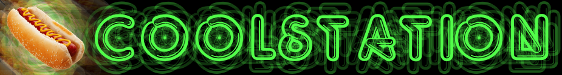
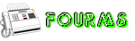
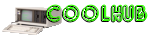

###  Welcome to the main repository for the Coolstation fork of the Goonstation branch of [Space Station 13](https://spacestation13.com/).

# SETUP

Want to get the code up and running? This guide is the place to go.  ***Be sure to follow it exactly!*** If you need help, visit the #imcoder channel on our Discord.

## COMMUNITY

The forums are where we get most of our player feedback/suggestions and talk about things in a more longform format. This is also the place to appeal any bans or give admin feedback.

Our wiki is the place to go for any information you seek on the various constructions, items, game modes, and more in-game. There's also guides for various jobs on station!

Goonhub is the premier place for locating statistics, data about rounds, detailed game maps, and all other links pertaining to Goonstation!

## CONTRIBUTING

Try not to! 

## FAQ (Frequently Asked Question)

#### Q: I'm getting a compilation error like `unable to open +secret\__secret.dme`.

You’ll need to create a file named `__secret.dme` in the +secret subdirectory. It should be blank and have no contents. Read the [Goonstation Development Guide](https://hackmd.io/@goonstation/docs/%2F%40goonstation%2Fdev) for additional details.

## LICENSE

All Goonstation contributions are licensed under [Creative Commons BY-NC-SA](https://creativecommons.org/licenses/by-nc-sa/3.0/). See LICENSE for more details.

**Important:** This means that code from Goonstation cannot be ported to codebases such as /tg/station. If you wish to port a specific feature, you must get the developer(s) to sublicense it to you under a license like AGPLv3. This also applies in the opposite direction for features ported from other codebases.
